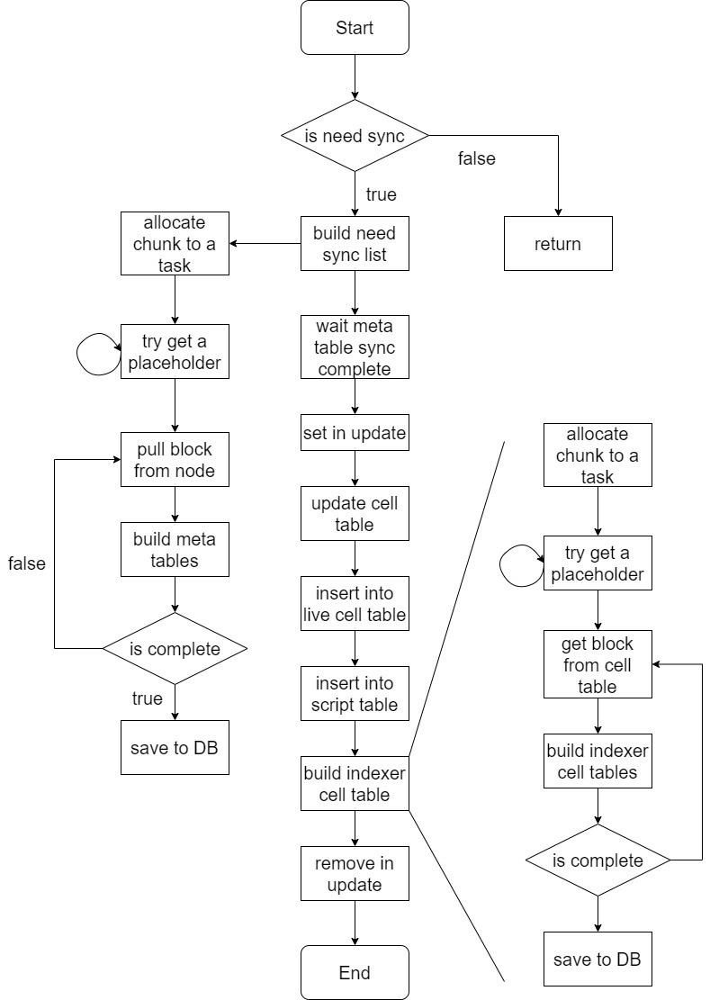

# Mercury Synchronization

## General

When mercury is started, a large amount of data needs to be synchronized. Because of mercury uses a relational database, which also makes parallel synchronization possible. Parallel synchronization is mainly to disperse the blocks to be synchronized into multiple threads to make full use of the advantages of multi-core processors to speed up the synchronization. In order to record the intermediate state in the synchronization process, some auxiliary tables are used during synchronization so that it can be quickly restored after restarting during the synchronization process.

## Concrete

### Necessity

Mercury stipulates that it is only in the synchronization state or mercury and ckb when exiting last time or the tip gap between mercury and CKB node exceeds 1000, the parallel synchronization can be performed.

### Storage structure

The data stored by mercury includes the following:

* block table: store the information in block header.
* transaction table: store the transactions information exclude cell related.
* cell table: store the cells information
* live cell table: store the cells that are not consumed.
* indexer cell table: store the cell with the structure same as ckb-indexer.
* script  table: store the scripts information.
* canonical chain table: store all the stored block numbers and hashes.
* consumed info table: store the cell info that are consumed.
* in update table: store if mercury is in update status before last quit.

Among them, consumed info table and in update table are additional data stored in the synchronization, which will be cleared at the end.

### Sync metadata table

#### What is metadata table

Mercury defines that data can be obtained directly from the CKB data structure and stored completely in one table, called metadata table. 

Thus, in the table described above, block table, transaction table, cell table are metadata table. **A principle of Mercury synchronization is to sync metadata tables in parallel and then generate other tables from them.** 

#### Arguments

There are two arguments controlling the process of synchronization. One is `max_task_number` the other is `sync_task_size`.

`max_task_number` is the maximum number of tasks that can be spawned to the thread pool at the same time. This argument impact the memory usage. A simple formula to calculate mercury memory usage is that:  $$memroy\_usage = 100 * max\_task\_number + 50\ (Mb)$$. It is based on the configuration of the deployment server.

`sync_task_size` is the count of blocks that allocated to each task. 

#### Process

At beginning, construct a list of block numbers that need to be synchronized. Divide this list into chunks with `sync_task_size`. Then allocate each chunk of block numbers to tasks. Before allocating, it is necessary to check whether the current number of tasks has reached `max_task_number`, and if so, wait 5 seconds before checking again.

As for a task, pull blocks from the node in batches of 10 through JsonRPC. And then build the block table, transaction table, cell table, canonical chain table and consumed info table in memory. After finish all the block numbers, save the data to Database.

The sign of the completion of metadata synchronization is that the count of block table is equal to the node tip.

### Sync assist-data table

Assist-data table is table that other than metadata table. On specially, means script table, live cell table and indexer cell table. The way to synchronize each table is different.

First, set `is_in` of in update table as `true`.

#### Sync live cell table

The cell table must be updated before the live cell table is built. According to `tx_hash` and `output_index`, the consumed info table and the cell table are correlated to complete the consumed info in the cell table. Then insert the data with empty consumed info in the cell table into the live table with block number from mercury tip to node tip.

#### Sync script table

At start, recreate the script table, this equal to clear the table. Then insert the script information stored in the cell table into the script table after deduplication according to script_hash.

#### Sync indexer cell table

Because of the indexer cell table is immense. Firstly, clear the lines that the block number is larger than mercury tip in indexer cell table. Divide this need built list into chunks with `sync_task_size`. Then allocate each chunk of block numbers to tasks. Before allocating, it is necessary to check whether the current number of tasks has reached `max_task_number`, and if so, wait 5 seconds before checking again. This step is same as the process in sync metadata table.

The building process in each task is that:

1. Take the cells from cell table which the block number or the consumed block number is in the given block number range.
2. Iterate the cells fetch at step 1, if the block number is in the range, build a line of indexer cell data, if the consumed block number if in the range, build a line of indexer cell data. That means, one line of cell table can be built as one or two line of indexer cell data.
3. Save all the data to the database.

After finish sync assist-data table, set `is_in` of in update table as `false`.

### Flow chart

The Flow chart is shown below:

